<p align="center">
  <a href="https://skills.coleoni.com">
    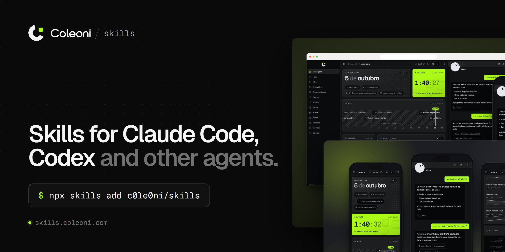
  </a>
</p>

<p align="center">
  <a href="https://skills.coleoni.com"><b>skills.coleoni.com</b></a>
  &nbsp;·&nbsp;
  <a href="https://coleoni.com">coleoni.com</a>
  &nbsp;·&nbsp;
  <a href="#license">MIT License</a>
</p>

<br>

The skills I use in my own workflow to ship projects, open and free. They work
in **Claude Code**, **Codex**, **Cursor**, **Gemini CLI** and any other agent
that reads `SKILL.md`.

## Install

```bash
npx skills add c0le0ni/skills
```

The installer lists the skills in this repository and asks which agents to add
them to. To skip the questions:

| I want | Command |
| --- | --- |
| A single skill | `npx skills add c0le0ni/skills --skill coleoni-thumb` |
| For my whole user, not just the project | `npx skills add c0le0ni/skills -g` |
| Claude Code only | `npx skills add c0le0ni/skills -a claude-code` |
| Codex only | `npx skills add c0le0ni/skills -a codex` |
| See the list without installing | `npx skills add c0le0ni/skills --list` |

It uses [`skills`](https://github.com/vercel-labs/skills), Vercel's open skills
installer. Requires Node.js 18 or newer.

## Skills

| Skill | What it does |
| --- | --- |
| [`/coleoni-thumb`](#coleoni-thumb) | Portfolio thumbnails and mockups from your project's real screens |
| [`/coleoni-briefing`](#coleoni-briefing) | Turns a client briefing into a decided scope, with a client-ready PDF |
| [`/coleoni-init`](#coleoni-init) | Sets up a new project's docs before any code, with a one-page overview |
| [`/coleoni-favicon`](#coleoni-favicon) | The complete favicon set from a logo, checked in tabs and home screens |
| [`/coleoni-og`](#coleoni-og) | Share images from your real pages, with the tags checked and every app previewed |
| [`/coleoni-launch`](#coleoni-launch) | Checks a whole site before it goes live, with a verdict and screenshots |
| [`/coleoni-copy`](#coleoni-copy) | Rewrites hype and vague copy into plain, specific text, in English or Portuguese |

<br>

### `/coleoni-thumb`

<a href="https://skills.coleoni.com/coleoni-thumb/">
  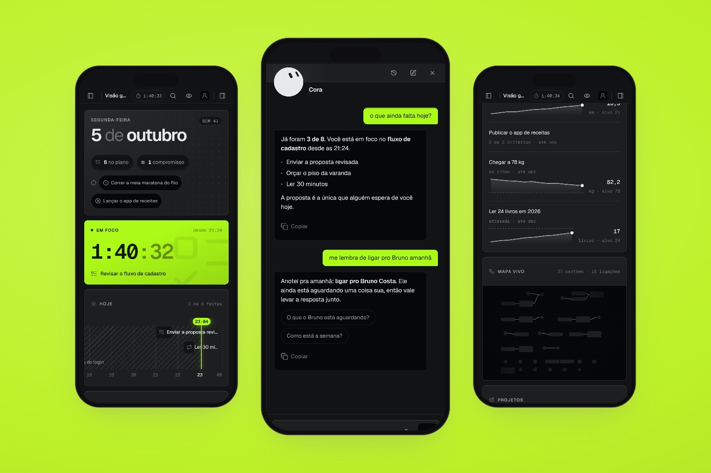
</a>

The skill opens the site, captures desktop and mobile, and sets the screens in
browser and phone frames on a background taken from the site's own palette.
Nothing is AI-generated: the image shows exactly what was shipped.

- **6 layouts:** `split`, `devices`, `wall`, `phones`, `focus` and `tilt`.
- **7 backgrounds:** `auto`, `dark`, `brand`, `mesh`, `grid`, `blur` or any hex color.
- **JPG at 1× and 2×**, in the size you ask for: 3:2, 16:9, 4:3, 4:5 feed or square.
- **No browser download.** It uses the Chrome or Edge already on the machine.
  The only package is `playwright-core`, which the agent installs on first use.

```text
/coleoni-thumb https://yoursite.com
/coleoni-thumb https://yoursite.com phones and devices on the brand background, 1080x1350
```

<table>
  <tr>
    <td width="50%">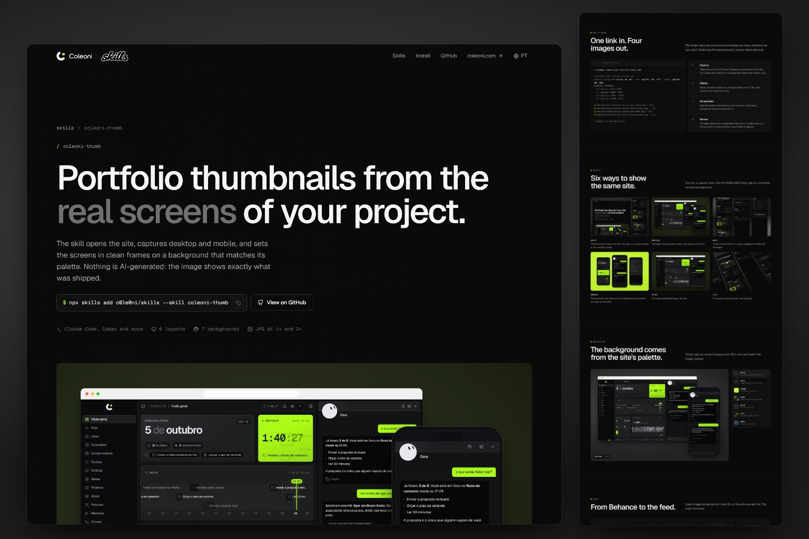<br><sub><code>split</code> · <code>auto</code></sub></td>
    <td width="50%">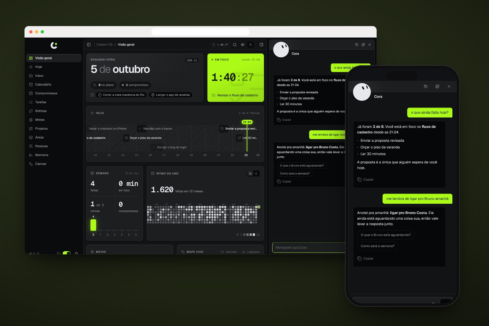<br><sub><code>devices</code> · <code>dark</code></sub></td>
  </tr>
  <tr>
    <td width="50%">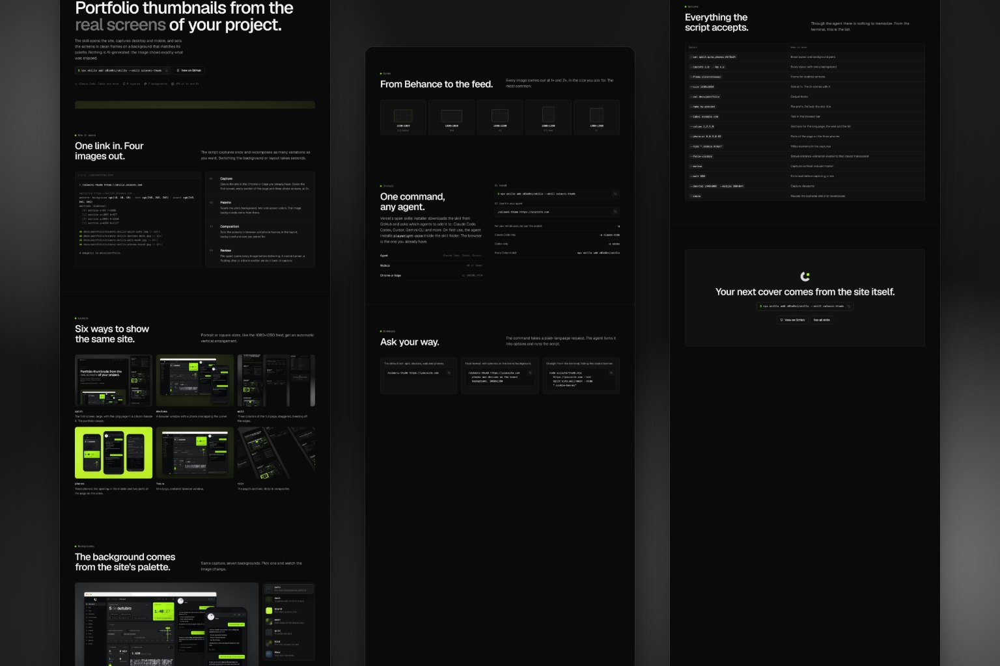<br><sub><code>wall</code> · <code>mesh</code></sub></td>
    <td width="50%">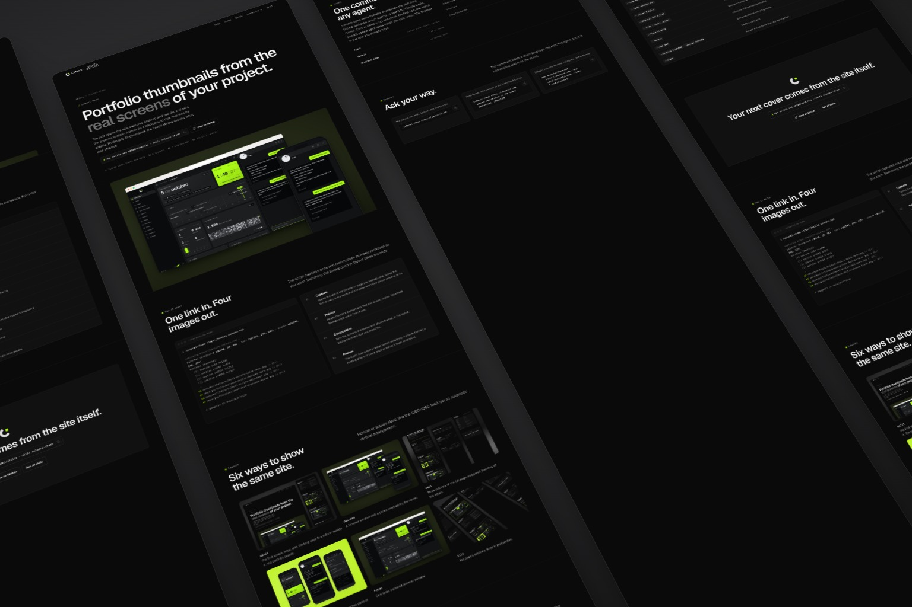<br><sub><code>tilt</code> · <code>dark</code></sub></td>
  </tr>
</table>

Every image on this page was made by the skill itself.
[See the full skill page](https://skills.coleoni.com/coleoni-thumb/).

<br>

### `/coleoni-briefing`

<a href="https://skills.coleoni.com/coleoni-briefing/">
  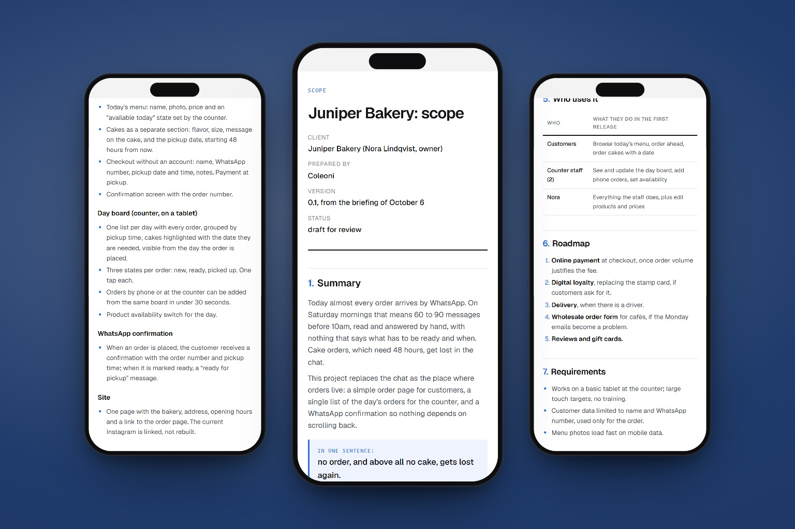
</a>

Clients describe the product they imagine. Their answers reveal a smaller,
sharper problem. This skill reads everything the client sent (form answers,
call notes, emails, chat exports) and writes a scope you can defend.

- **One pain first.** The single problem that already justifies the project,
  cited from the client's own answers.
- **What they already use stays out.** Each cut names the tool that already
  does the job, so the client sees why.
- **First release, roadmap, open questions and a deadline check**, in a
  ten-section document that reads in ten minutes.
- **Client-ready PDF.** `--pdf` renders a clean A4 document with your accent
  color and logo, using the Chrome already on the machine.

```text
/coleoni-briefing briefing/answers.csv
/coleoni-briefing client-notes.md --pdf
```

A full example, from messy briefing to scope, lives in
[`skills/coleoni-briefing/examples/juniper-bakery`](skills/coleoni-briefing/examples/juniper-bakery).

<br>

### `/coleoni-init`

<a href="https://skills.coleoni.com/coleoni-init/">
  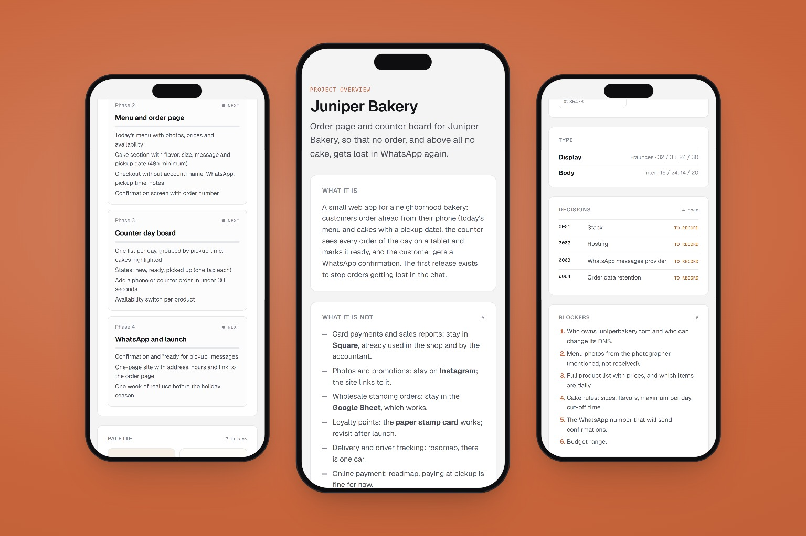
</a>

Before the first line of code, a project needs to say what it is, what it is
not, what was decided and what is still open. This skill reads the scope (and
the mockups or brand, when there are any) and writes that skeleton.

- **An agent guide for every agent.** `AGENTS.md` with the same eight sections
  every time, plus a one-line `CLAUDE.md` pointing to it.
- **Roadmap, status, glossary, decision records** and, when there is personal
  data, a privacy note (LGPD, GDPR).
- **Real design tokens** taken from the mockups or brand, never invented.
- **No stack, no code.** Heavy choices become pending decision records for the team.
- **One-page overview.** `--overview` turns the docs into a single HTML page with
  phases, palette, open decisions and blockers.

```text
/coleoni-init
/coleoni-init ./my-project --write --overview
```

The example continues the bakery from `/coleoni-briefing`:
[`skills/coleoni-init/examples/juniper-bakery`](skills/coleoni-init/examples/juniper-bakery).

<br>

### `/coleoni-favicon`

<a href="https://skills.coleoni.com/coleoni-favicon/">
  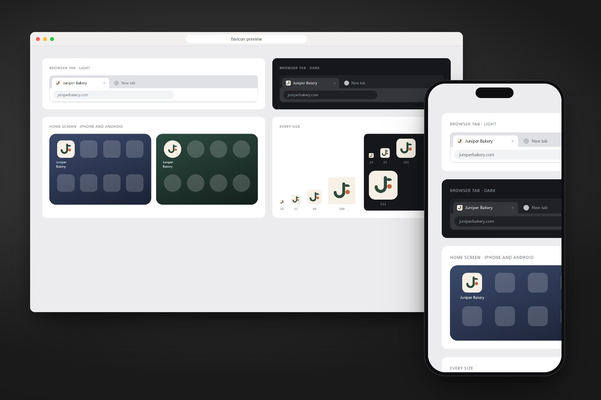
</a>

One logo in, every icon out, each one checked where it actually appears.

- **The whole set:** `favicon.svg` (with dark mode), `favicon.ico` with 16, 32
  and 48 inside, PNGs, the iPhone icon, Android icons including maskable,
  `site.webmanifest` and the `<head>` tags.
- **A preview sheet** with light and dark browser tabs, iPhone and Android home
  screens and every size side by side, so a 16px problem shows before launch.
- **Crops part of a logo** (one letter, the symbol of a lockup) with `--crop`.
- **Installs it** the way the framework expects: `app/` for Next.js, the public
  folder plus `<head>` tags for the rest.

```text
/coleoni-favicon public/logo.svg
/coleoni-favicon brand/mark.svg on #0a0a0a, rounded, install it
```

<br>

### `/coleoni-og`

<a href="https://skills.coleoni.com/coleoni-og/">
  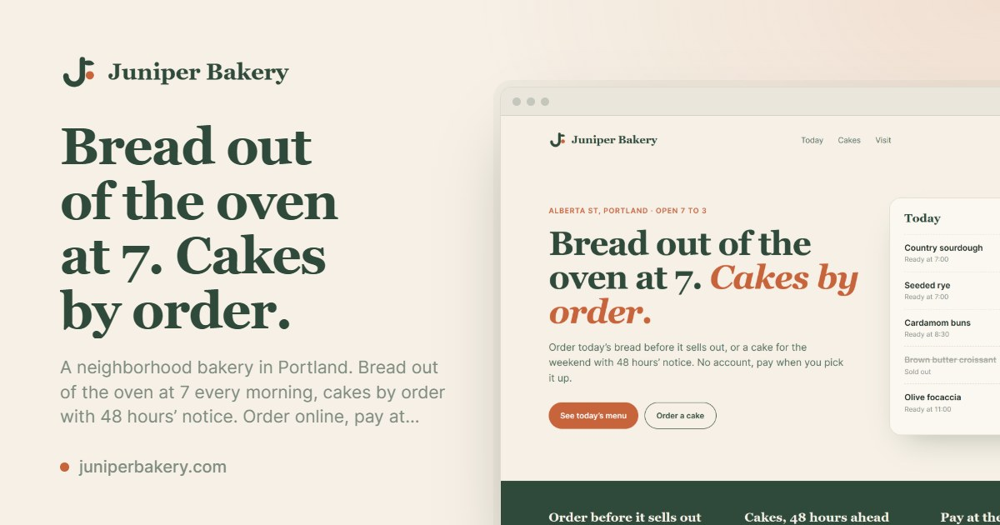
</a>

The picture a link shows when someone shares it, made from the page itself:
its headline, its logo, its fonts and colors, and the page in a browser frame.

- **Three layouts:** `screen` (text and the page), `title` (type only) and
  `hero` (the page's own first screen), all 1200x630, around 100 KB.
- **Tags checked like a bot reads them.** Title, description, `og:*`,
  `twitter:card`, image size, ratio, weight and URL, page by page.
- **A preview sheet** with the link in WhatsApp, X, LinkedIn, iMessage, Slack
  and Discord, today and with the new tags.
- **A whole site at once** from its sitemap, then installed the way the
  framework expects.

```text
/coleoni-og https://yoursite.com
/coleoni-og the whole site from the sitemap, title layout for the blog, install it
```

The share images of [skills.coleoni.com](https://skills.coleoni.com) were made
by this skill.

<br>

### `/coleoni-launch`

<a href="https://skills.coleoni.com/coleoni-launch/">
  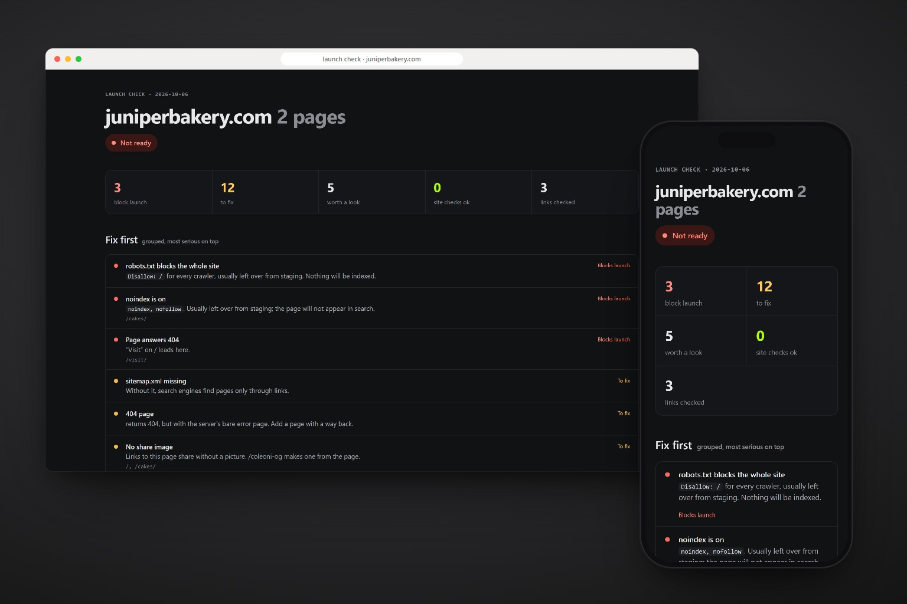
</a>

Opens every page like a careful first visitor and a search engine would, then
says plainly whether the site is ready.

- **Blockers first:** `noindex` and `Disallow: /` left from staging, pages and
  links that 404, scripts that fail, no HTTPS, no viewport.
- **Then the rest:** console errors, mixed content, Lorem ipsum and other
  placeholders, missing titles and share images, sideways scroll on the phone,
  heavy images, sitemap, 404 page, redirects, security headers, compression.
- **A report you can send:** verdict, issues grouped across pages, and every
  page on desktop and phone.
- **Live sites, staging, dev servers or a build folder**, which it serves itself.

```text
/coleoni-launch https://yoursite.com
/coleoni-launch ./dist, domain yoursite.com, fix what you can
```

<br>

### `/coleoni-copy`

<a href="https://skills.coleoni.com/coleoni-copy/">
  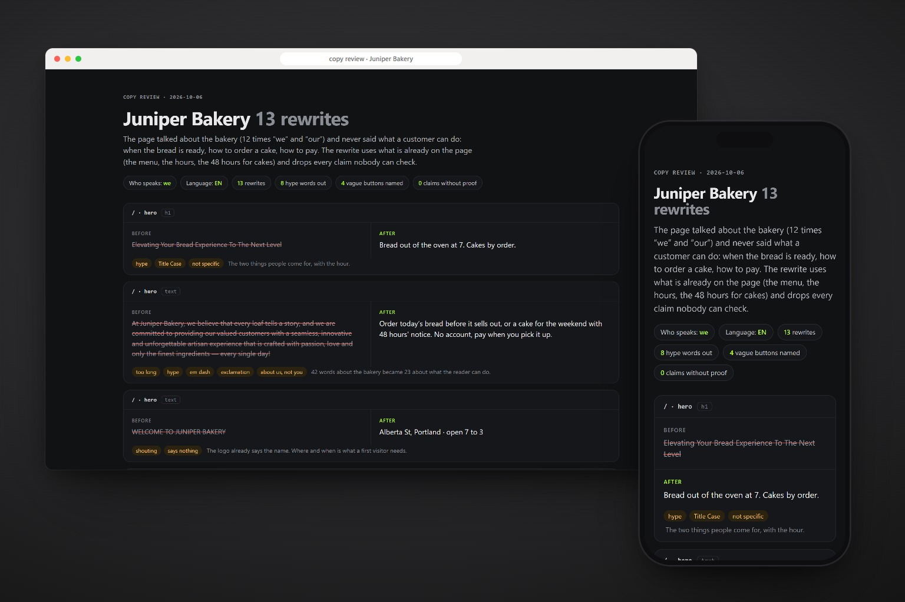
</a>

Reads a product the way its reader does and rewrites every sentence that talks
to itself instead of to them.

- **Every piece of text listed:** titles, headings, buttons, links, labels,
  placeholders and alt text, with hype, vague buttons, long sentences, em
  dashes, Title Case and "we, we, we" pages flagged.
- **The project's voice first.** Its own guide wins; a plain, specific default
  voice fills the gaps, with patterns for buttons, forms, errors and empty states.
- **Nothing invented.** Every fact in the rewrite comes from the product. What
  is missing becomes a question, not a made-up number.
- **English and Brazilian Portuguese**, each written on its own, with a before
  and after sheet you can send to the client.

```text
/coleoni-copy https://yoursite.com
/coleoni-copy src/ (the app's buttons, errors and empty states), apply it
```

## Made by

<a href="https://coleoni.com">
  <picture>
    <source media="(prefers-color-scheme: dark)" srcset=".github/assets/coleoni-lockup-dark.svg">
    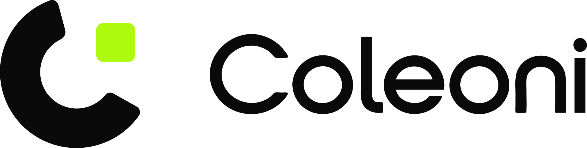
  </picture>
</a>

**Michel Coleoni**, a developer who builds custom websites. These skills come
out of Coleoni's projects and are open for anyone to use.

- Website: [coleoni.com](https://coleoni.com)
- Skills: [skills.coleoni.com](https://skills.coleoni.com)

If a skill helped you, a star on this repository helps spread the word.

## License

[MIT](LICENSE). Use it, change it and share it freely, keeping the copyright
notice with Coleoni's name.
